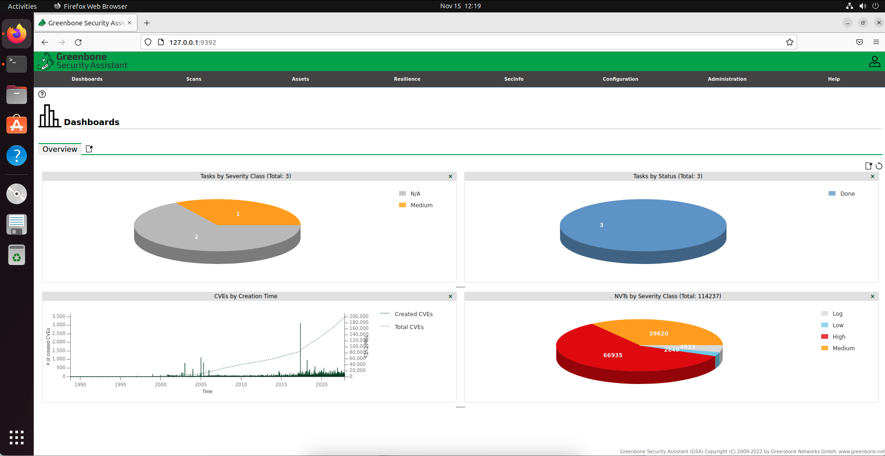
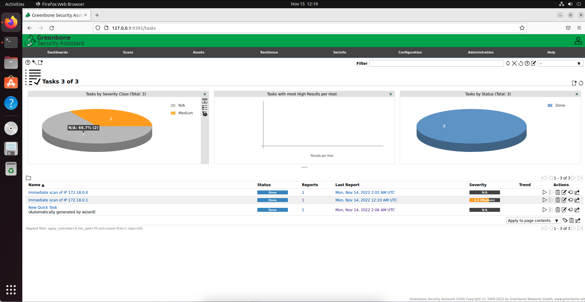

# docker-compose-project
This document is a step by step guide to installing Docker and configuring an openVAS/Greenbone vulnerability scanner via the new Docker installation

To complete this project, I installed a new Ubuntu virtual machine on my laptop and chose to install greenbone on that.

A lot of credit belongs to Greenbone themselves because they have documentation online that makes the installation a bit smoother. For reference, this is one page I used heavily when I ran into issues:

https://greenbone.github.io/docs/latest/22.4/container/index.html


# (1) Install packages
For this project, you need to install `docker.io`, `docker-compose`, and `curl`. Since I am using a fresh Ubuntu install, I needed to specify that docker was a program that I was allowed to run. 
```zsh
sudo apt install docker.io docker-compose curl
sudo usermod -aG docker sean
su sean
```
# (2) Make your docker-compose file
I used a pre-written docker-compose file from greenbone's official website. After downloading it directly to my directory, I opened it using `nano` to check that the configuration matched what I needed.
```zsh
mkdir openvas
cd openvas
curl -f -L https://greenbone.github.io/docs/latest/_static/docker-compose-22.4.yml -o docker-compose.yml
```
# (3) Pull the required resources
You `docker-compose.yml` file is used to specify which resources should be downloaded for you container. This makes it easy to download everything using just one command in the terminal.
```zsh
docker-compose -f docker-compose.yml -p greenbone-community-edition pull
```
# (4) Run the container
```zsh
docker-compose -f docker-compose.yml -p greenbone-community-edition up -d
```
I used the official greenbone community resources provided by their website.
# (5) Connect to the web interface
Once your container is finishing setting up, you can run the following command to access the dashboard.
```zsh
xdg-open "http://127.0.0.1:9392" 2>/dev/null >/dev/null &
```
This should open a new web browser session at the specified address. You are hosting the scanner locally so it uses your local loopback address and a port specified in your docker-compose file. If the terminal command doesn't work automatically, you can open a web browser session yourself and just type in the ip address.

Your dashboard will be unpopulated because you haven't run any tasks yet.

# (6) Change your user's password
When the new container boots up, it uses a default username and password (admin, admin) to access the web interface. After you see the login prompt and put in the default credentials, you should immediately go to the top right section and find the `user` tab. This will allow you to change your password to something more secure.

# (7) Run your first scan

After about 30 minutes, your container should be completely ready for use (it takes some time for all of the resources to finish downloading). You can run your very first scan by going to the `scans` tab and clicking the top left button that will run a quick scan. You should only run scans on IP addresses that you own, so I only ran a scan on my own device to see what the results would be. 

